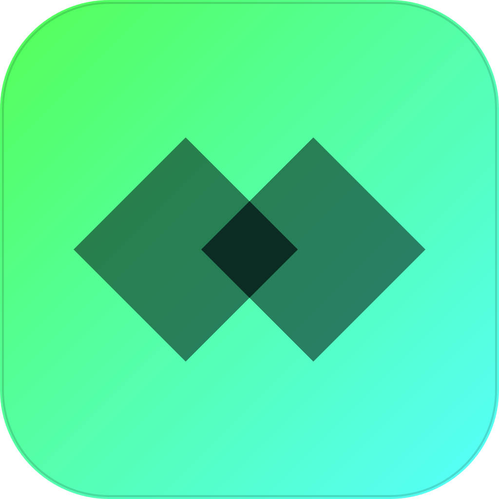

  

# Dyad Launcher

    
    
    

    

    

## Dyad Launcher

Dyad Launcher is a fork of the [Modrinth Monorepo](https://github.com/modrinth/code), focused on
the **desktop app**. The name comes from *dyad* (Greek, "a pair") — the core feature being able to
run two linked instances of the same setup side by side. See [docs/GOALS.md](docs/GOALS.md) for what this fork is specifically trying to build and why.

If you're looking for the official Modrinth application, you're lost and should go to [modrinth.com](https://modrinth.com/).
If you want a more private, more streamlined, and decluttered version that also supports multiple instances at the same time; You're in the right spot.
Visit [our site](https://dyad.creulcat.nl/) to download the latest version.

## Goals

This fork's focus is entirely the desktop launcher (`apps/app`, `apps/app-frontend`, and the
`theseus` library in `packages/app-lib`), primarily on Windows.

1. **Concurrent multi-account launches** — open the same instance more than once at a time, each
   under a different Microsoft account, when the instance opts into it.
2. **Debloating** — strip telemetry/analytics, account/login promos & ads, and news/social panels
   from the desktop app, while keeping (and tuning) Discord Rich Presence, which is now Dyad-branded,
   opt-in (off by default), and can be hidden per instance.
3. **Update notifications** — Modrinth's own update checks are disabled for this fork; Dyad checks
   its own GitHub Releases and shows a banner with a download link when a new version is out. It
   doesn't update itself in place.
4. **Import from Modrinth App** — bring existing instances and selected settings over from an
   official Modrinth App install, with per-instance and per-category control.

Full detail, current status, and known tradeoffs are in [docs/GOALS.md](docs/GOALS.md).

## License

Dyad Launcher's own code — `apps/app`, `apps/app-frontend`, and `packages/app-lib` — is licensed
under the [GNU GPLv3](LICENSE). Other packages retained from upstream Modrinth (e.g. the web
frontend and `labrinth` backend) carry their own license; see [COPYING.md](COPYING.md) for the
per-package breakdown and for branding/trademark exclusions.

## Disclaimer

_Dyad Launcher is an independent project and is not affiliated with, endorsed by, or sponsored by Modrinth, or by Mojang/Minecraft._
